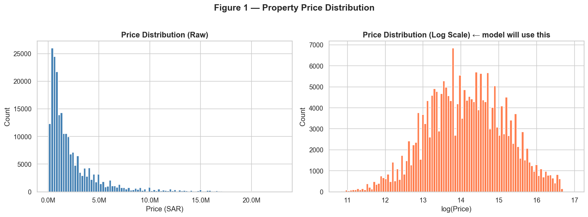
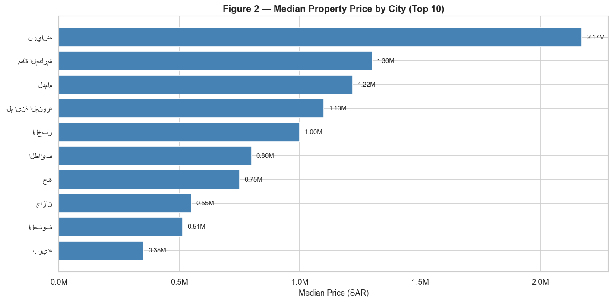
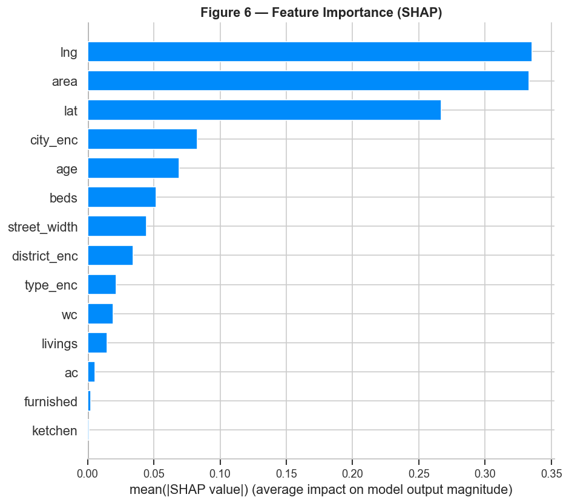
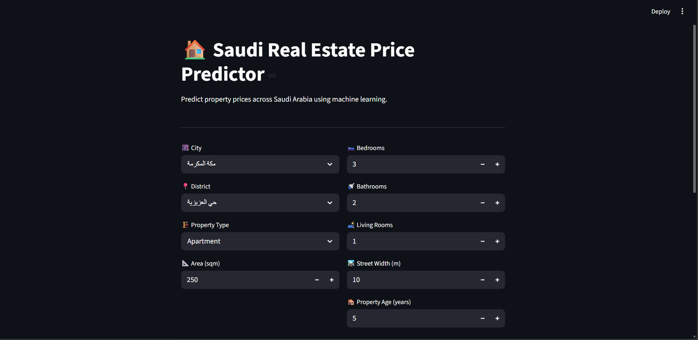
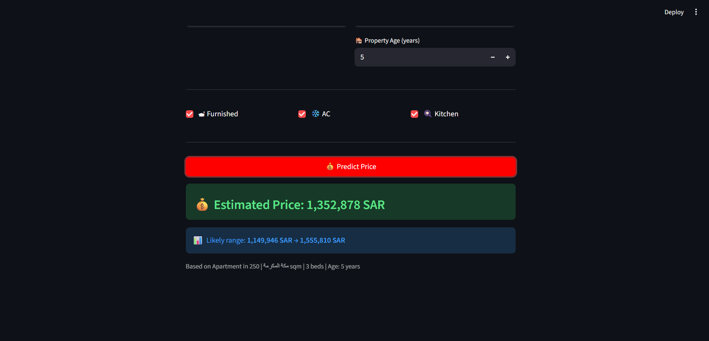

# 🏠 Saudi Real Estate Price Predictor

A machine learning web app that predicts property prices across Saudi Arabia using XGBoost.
Built on 220,000+ real listings scraped from aqar.fm — one of Saudi Arabia's largest real estate platforms.

---

## 🔴 Live Demo

👉 [Try the app here](https://huggingface.co/spaces/YOUR_USERNAME/saudi-real-estate-predictor)
_(link will be active after deployment)_

---

## 📊 Project Results

| Metric        | Score       |
| ------------- | ----------- |
| R² Score      | 0.84        |
| MAE           | 479,595 SAR |
| Algorithm     | XGBoost     |
| Training rows | 176,984     |
| Features used | 14          |

---

## 📊 EDA Highlights

### Price Distribution



### Median Price by City



### SHAP Feature Importance



## 🖥️ App Demo



## 

## 🔍 Key Findings

- **Location dominates price** — longitude & latitude are the top 2 most important features (SHAP analysis)
- **Riyadh is the most expensive** city with a median price of 2.17M SAR
- **Area and age** are stronger predictors than number of bedrooms
- **Log-transformation** of price was essential — raw prices were heavily right-skewed
- Model explains **84% of price variation** despite missing interior quality and view data

---

## ⚙️ How to Run Locally

```bash
git clone https://github.com/YOUR_USERNAME/saudi-real-estate-predictor
cd saudi-real-estate-predictor
pip install -r requirements.txt
streamlit run app/app.py
```

---

## 🧠 Technical Details

**Data:** 760k raw listings → 221k after cleaning

- Removed rentals (price < 50,000 SAR)
- IQR outlier removal per city (smarter than global cutoff)
- Filled missing lat/lng with city medians

**Features:** Area, beds, bathrooms, living rooms, street width, age, furnished, AC, kitchen, latitude, longitude, city, district, property type.

**Model:** XGBoost Regressor

- Target: log(price) — converted back to SAR for display
- Train/test split: 80/20
- Early stopping: 50 rounds

**Explainability:** SHAP values used to identify feature importance and direction of impact.

---

## 📈 EDA Highlights

| Plot               | Insight                                          |
| ------------------ | ------------------------------------------------ |
| Price Distribution | Heavy right skew → log transform needed          |
| Price by City      | Riyadh 2.17M SAR vs Buraidah 0.35M SAR           |
| Price vs Area      | Non-linear relationship, location confounds size |
| SHAP Analysis      | Location (lng/lat) > Area > City > Age           |

---

## 🛠️ Tech Stack


---

- LinkedIn: [your-linkedin](https://www.linkedin.com/in/fadwa-ramadan-hassan/)
